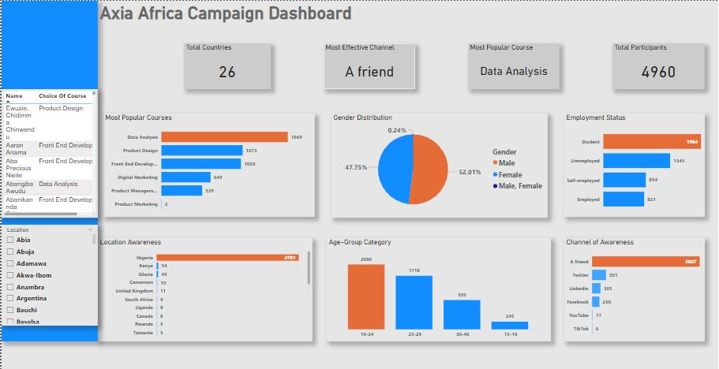
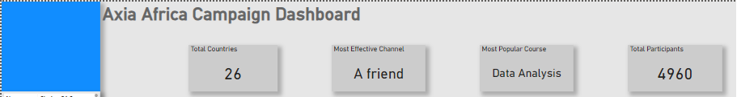
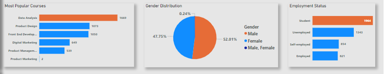
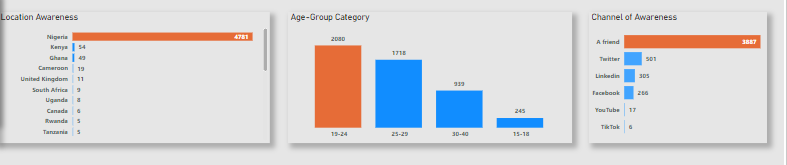

# Bootcamp-Campaign
## Introduction
 
---
This dataset was given as a Power BI project during my training in the School of Data at Axia Africa. 
The dataset was obtained from the academy’s bootcamp campaign held in 2023.

## Problem Statement
---
Axia Africa is seeking to promote the sale of their courses and improve their marketing strategy.
To do this, the organization wants answers to the following questions:
1.	What is the gender distribution?
2.	Which channels are most effective in driving awareness of our online bootcamp?
3.	What are the most popular courses or programs chosen by individuals?
4.	What is the location awareness of our services?
5.	What is the employment status of participants?
6.	What is the age-group category of participants?
7.	Who is interested in our courses?

## Data Sourcing
---
After understanding the business questions, I proceeded to download the dataset which was in a CSV format.
I performed an exploratory data analysis before taking it to Power Query to transform.

## Skill Demonstrated
---
- 	Data cleaning with Power Query
- 	Data Formatting with Excel
- 	DAX with Power BI
- 	Data visualization with Power BI

## Data Transformation
---
While carrying out exploratory data analysis, I noticed the following:
 1.	The dataset had just 1 table.
 2.	Some of the columns like email address, timestamp, and phone number were irrelevant to the analysis.
 3.	The name column had duplicates
 4.	The location column contained a mixture of states and countries. To clean it, I added another column which listed the country names while the first column contained only state names.
 5.	Apart from the age-group column, the data had no integers which is needed during visualization. To solve this, I added another column which represents the click rate of the participants. Since I had removed the duplicates based on names, all the cells on the new column carried the value 1.

_After cleaning, I uploaded the new file to Power BI._

## Data Modelling
---
The dataset had 1 table, hence there was nothing to establish a relationship with 🤓.

## Analysis/ Visualization
---

At the end of the analysis, I had 11 visuals, 4 of which were cards.
You can interact with the report [here](https://app.powerbi.com/groups/me/reports/60c57313-b0a6-4be5-afb4-0ccef9d905e8/ReportSection?experience=power-bi)

### Cards
---

These were derived using the DAX formula MIN and DISTINCTCOUNT. 

### Visualization (First Half)
---

1. The most popular course chosen is Data Analysis followed by Product Design. Product Marketing is the least course.
 2.	The number of males reached is slightly higher than females. 0.24% of the participants identified as male, female.
 3.	Most of the participants are students.

### Visualization [second half]
---

 1.	Nigeria is the country with the highest reach.
 2.	Participants with the highest reach are aged between 19-24.
 3.	More than half of the participants were reached through a friend. TikTok and YouTube are the channels with the least awareness rate.

## Conclusion
---
For a more successful campaign, efforts should be made to encourage word-of-mouth marketing.
Since most of the participants are students and unemployed persons, the course tuition can be split to encourage payment in instalments.

## Recommendation
---
For better, data from previous years is required 🙂. 

